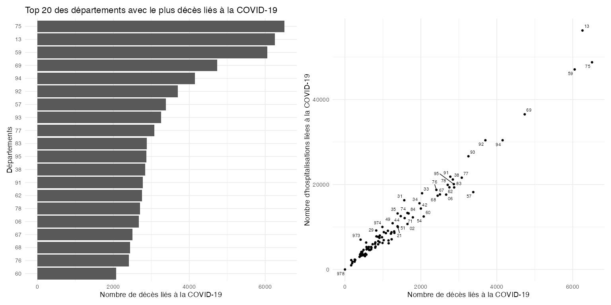
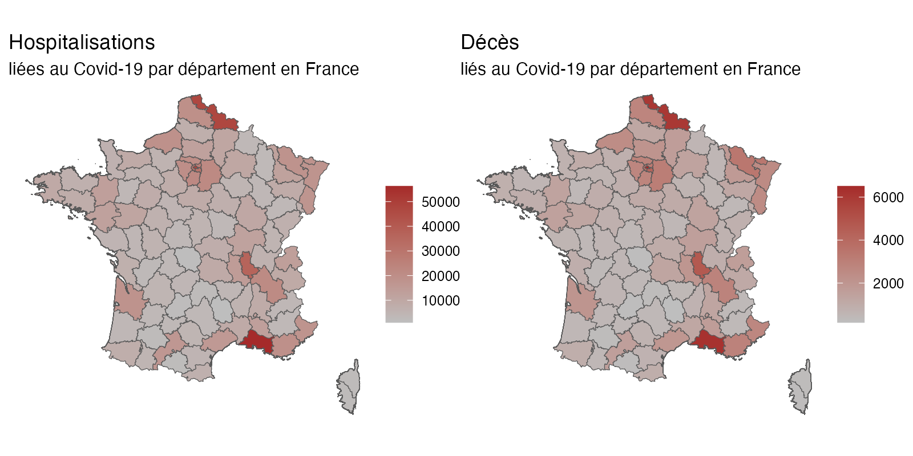

```{r setup, include = FALSE}
library(learnr)
library(tutorial.helpers)
library(epitutorials)
library(knitr)
library(tidyverse)
library(ggthemes) 
library(data.table)
library(ggplot2)
library(geodata)
library(sf)
library(here)
library(ggrepel)
library(DataExplorer)
library(ggiraph)
library(patchwork)

# dtbaseAllHosp = fread("https://www.data.gouv.fr/fr/datasets/r/6fadff46-9efd-4c53-942a-54aca783c30c")
# usethis::use_data(dtbaseAllHosp, overwrite = TRUE)

#raw data
mydata = copy(epitutorials::dtbaseAllHosp)

#deces hosp par dept
deces_hosp_par_dep = mydata[, list(deces = sum(incid_dc), hospitalisations = sum(incid_hosp)), by = "dep"]


#fr_map = geodata::gadm("FRA", path = here("inst", "tutorials", "1-data-visualization", "data"), level=2)
#setwd(here("inst", "tutorials", "1-data-visualization"))
fr_map = geodata::gadm("FRA", path = "data", level=2)
sf_fr_map = st_as_sf(fr_map)

deces_hosp_par_dep_sf = merge(sf_fr_map, 
                              deces_hosp_par_dep, 
                              by.x = "CC_2", 
                              by.y = "dep", 
                              all.x = TRUE)

knitr::opts_chunk$set(echo = FALSE)
knitr::opts_chunk$set(out.width = '90%')
options(tutorial.exercise.timelimit = 60, 
        tutorial.storage = "local") 
```

```{r copy-code-chunk, child = system.file("child_documents/copy_button.Rmd", package = "tutorial.helpers")}
```

```{r info-section, child = system.file("child_documents/info_section.Rmd", package = "tutorial.helpers")}
```

## Introduction
### 

Ce tutoriel a pour objectif de vous faire explorer et visualiser des données de santé tout en vous familiarisant avec les packages `data.table`, `DataExplorer`, `ggplot2`. A la fin de ce tutoriel, vous pourrez reprendre les graphiques réalisés et les rendre interactif avec le package `ggiraph`. 

## Découvrir les données
### 

Nous allons utiliser la librairie `data.table`. C'est une extension de la librairie de base de R qui permet de manipuler des données de manière plus efficace que les data.frames. Elle est particulièrement adaptée pour manipuler de grandes quantités de données.

Cliquez sur le lien vers la documentation de la librairie data.table pour pouvoir la consulter au besoin: <https://cran.r-project.org/web/packages/data.table/vignettes/datatable-intro.html>

Cliquez sur le lien vers la cheatsheet de data.table pour voir une synthèse de ses usages: <https://s3.amazonaws.com/assets.datacamp.com/blog_assets/datatable_Cheat_Sheet_R.pdf>

### Exercise 1

Chargez la librairie `data.table`.

```{r dcouvrir-les-donnes-1, exercise = TRUE}

```

```{r dcouvrir-les-donnes-1-hint-1, eval = FALSE}
# Utilisez la fonction library() pour charger la librairie data.table
library(...)
```

```{r dcouvrir-les-donnes-1-test, include = FALSE}
library(data.table)
```

### Exercise 2

Nous voulons télécharger des données directement depuis une URL.
Pour cela, nous allons utiliser la fonction `fread()` de la librairie data.table.
L'URL utilisée est la suivante : <https://www.data.gouv.fr/fr/datasets/r/6fadff46-9efd-4c53-942a-54aca783c30c> et nous voulons stocker ces données dans un objet nommé `mydata`.

```{r dcouvrir-les-donnes-2, exercise = TRUE}

```

```{r dcouvrir-les-donnes-2-hint-1, eval = FALSE}
mydata = fread("https://www.data.gouv.fr/fr/datasets/r/6fadff46-9efd-4c53-942a-54aca783c30c")
```

```{r dcouvrir-les-donnes-2-test, include = FALSE}
mydata = fread("https://www.data.gouv.fr/fr/datasets/r/6fadff46-9efd-4c53-942a-54aca783c30c")
```

### Exercise 3

Tapez `mydata` dans la console pour afficher le contenu de l'objet.

```{r dcouvrir-les-donnes-3, exercise = TRUE}

```

```{r dcouvrir-les-donnes-3-hint-1, eval = FALSE}
mydata
```

```{r dcouvrir-les-donnes-3-test, include = FALSE}
mydata
```

### 

Vous pouvez voir que les données sont stockées dans un objet de type data.table et que celles-ci ont des types adaptés (int, chr, IDate).
Si vous voulez en savoir plus sur ces types, vous pouvez tapez `?int` par exemple, dans la console.

### Exercise 4

Utilisez la fonction `str()` pour afficher la structure des données stockées dans l'objet `mydata`.

```{r dcouvrir-les-donnes-4, exercise = TRUE}

```

```{r dcouvrir-les-donnes-4-hint-1, eval = FALSE}
str(...)
```

```{r dcouvrir-les-donnes-4-test, include = FALSE}
str(mydata)
```

### Exercise 5

Combien y a-t-il de lignes dans les données stockées dans l'objet `mydata`?

```{r dcouvrir-les-donnes-5}
question_text(NULL,
	message = "La bonne réponse est ",
	answer(11306, correct = TRUE),
	allow_retry = FALSE,
	incorrect = NULL,
	rows = 1)
```

### 

Il est important avant de commencer à analyser des données d'en connaitre la source, et de se renseigner sur les variables disponibles.
Dans notre cas, les données proviennent de la plateforme data.gouv.fr et concernent les hospitalisations et les décès liés au Covid-19 en France.
Allez visiter ce lien pour en savoir plus sur ces données: <https://www.data.gouv.fr/fr/datasets/donnees-hospitalieres-relatives-a-lepidemie-de-covid-19/>.

### Exercise 6

Faites un copier/coller du paragraphe correspondant à la description des données hospitalières relatives à l'épidémie de Covid-19 en France (un des 5 proposés).

```{r dcouvrir-les-donnes-6}
question_text(NULL,
	message = "Place correct answer here.",
	answer("Les données hospitalières quotidiennes relatives à l'épidémie du COVID-19 par département : nombre quotidien de personnes nouvellement hospitalisées, nombre quotidien de nouvelles admissions en réanimation, nombre quotidien de personnes nouvellement décédées, nombre quotidien de nouveaux retours à domicile.", correct = TRUE),
	allow_retry = TRUE,
	incorrect = "Ce n'est pas la bonne réponse.",
	rows = 6)
```

###

Ce petit moment de lecture passé, il est temps de passer à l'exploration des données.

## Explorer les données
### 

Nous allons maintenant utiliser le package DataExplorer pour explorer les données stockées dans l'objet `mydata`.
Le package DataExplorer permet de générer des graphiques et des statistiques descriptives pour explorer les données.
Il contient notamment des fonctions pour visualiser les données manquantes, les distributions des variables, les corrélations, etc.
Vous pouvez consulter la documentation de DataExplorer pour en savoir plus sur ses fonctionnalités: <https://boxuancui.github.io/DataExplorer/>

### Exercise 1

Chargez la librairie DataExplorer.

```{r explorer-les-donnes-1, exercise = TRUE}

```

```{r explorer-les-donnes-1-hint-1, eval = FALSE}
library(...)
```

```{r explorer-les-donnes-1-test, include = FALSE}
library(DataExplorer)
```

### Exercise 2

Utilisez la fonction `plot_intro()` de DataExplorer pour afficher un résumé des données stockées dans l'objet `mydata`.

```{r explorer-les-donnes-2, exercise = TRUE}

```

```{r explorer-les-donnes-2-hint-1, eval = FALSE}
plot_intro(...)
```

```{r explorer-les-donnes-2-test, include = FALSE}
plot_intro(mydata)
```

### Exercise 3

Combien y a-t-il de variables continues dans les données stockées dans l'objet `mydata`?

```{r explorer-les-donnes-3}
question_text(NULL,
	answer(4, correct = TRUE),
	allow_retry = TRUE,
	incorrect = "Ce n'est pas la bonne réponse.",
	rows = 1)
```

### Exercise 4

Utilisez la fonction `plot_missing()` de DataExplorer pour afficher un graphique des données manquantes dans l'objet `mydata`.

```{r explorer-les-donnes-4, exercise = TRUE}

```

```{r explorer-les-donnes-4-hint-1, eval = FALSE}
plot_missing(...)
```

```{r explorer-les-donnes-4-test, include = FALSE}
plot_missing(mydata)
```

### Exercise 5

L'objet `mydata` contient-il des données manquantes ?

```{r explorer-les-donnes-5}
question_text(NULL,
	answer("non", correct = TRUE),
	allow_retry = TRUE,
	incorrect = "raté",
	rows = 1)
```

### 

Le package DataExplorer nous permet de visualiser rapidement les données et de détecter les valeurs manquantes.
Cela nous donne une idée de la qualité des données et des étapes de nettoyage éventuelles à effectuer.
Il contient aussi une fonction `create_report()` qui permet de générer un rapport complet sur les données.

### 

Néanmoins, rien ne vaut une première visualisation des données pour finir cette exploration. Nous avons des séries temporelles de décès et d'hospitalisations par département, il serait intéressant de les visualiser pour mieux comprendre la situation.

### Exercise 6

Utilisez la fonction `ggplot()` de la librairie `ggplot2` pour afficher les séries temporelles des hospitalisations par département.
Pour cela, vous allez devoir utiliser la fonction `geom_line()` pour afficher les courbes des séries temporelles.


```{r explorer-les-donnes-6, exercise = TRUE}

```

```{r explorer-les-donnes-6-hint-1, eval = FALSE}

```

```{r explorer-les-donnes-6-test, include = FALSE}
ggplot(data = mydata) +
  geom_line(aes(x = jour, y = incid_hosp)) +
  scale_y_continuous(name = "Incidences des hospitalisations pour COVID19") +
  scale_x_date(name = NULL) 
```

### 

On distingue relativement clairement des vagues épidémiques successives, avec des pics d'hospitalisations plus ou moins marqués. Néanmoins, toutes les courbes sont superposées, ce qui rend la visualisation peu lisible.

### Exercise 7

Modifiez le code précédant, et utilisez la fonction `facet_wrap()` pour afficher les courbes des séries temporelles des hospitalisations par département sur des graphiques séparés.
Notez que la variable doit être précédée de `~` pour être utilisée dans `facet_wrap()`.

```{r explorer-les-donnes-7, exercise = TRUE}

```

<button onclick = "transfer_code(this)">Copy previous code</button>

```{r explorer-les-donnes-7-hint-1, eval = FALSE}

```

```{r explorer-les-donnes-7-test, include = FALSE}
ggplot(data = mydata) +
  geom_line(aes(x = jour, y = incid_hosp)) +
  scale_y_continuous(name = "Incidences des hospitalisations pour COVID19") +
  scale_x_date(name = NULL) +
  facet_wrap(~dep) +
  theme_minimal()
```

### 

C'est un beau graphique. J'espère qu'il ressemble à celui-ci dessous. Passons maintenant à la manipulation de données.

`r include_graphics("images/ts_dep.jpg")`


## Premiers calculs
Nos données sont dans une `data.table` qui s'appelle `mydata`.
Nous allons maintenant effectuer quelques calculs simples sur ces données pour mieux les comprendre.
Comme vous l'avez vu dans l'aide de `data.table`, on peut effectuer des calculs directement dans le champs `j` de `data[ i , j ]`.

Cela nous permettra de créer les graphiques suivants: 

```{r echo = FALSE, fig.align = 'center', out.width = "70%"}

```

### 

### Exercise 1

Dans un premier temps, calculez la somme totale des décès.

```{r premiers-calculs-1, exercise = TRUE}

```

```{r premiers-calculs-1-hint-1, eval = FALSE}
mydata[, sum(...)]
```

```{r premiers-calculs-1-test, include = FALSE}
mydata[, sum(incid_dc)]
```

### 

Comme vous le voyez, avec `data.table`, on peut réaliser des opérations de calculs de manière simple et efficace, directement dans le champ des colonnes de la data.table (après la virgule).

### Exercise 2

On peut aussi en effectuer plusieurs en même temps en les plaçant dans une liste.

Calculez la somme des décès et des hospitalisations.

```{r premiers-calculs-2, exercise = TRUE}

```

<button onclick="transfer_code(this)">

Copy previous code

</button>

```{r premiers-calculs-2-hint-1, eval = FALSE}
mydata[, list(sum(incid_dc), sum(...))]
```

```{r premiers-calculs-2-test, include = FALSE}
mydata[, list(sum(incid_dc), sum(incid_hosp))]
```

### 

Nous savons maintenant qu'il y a eu un total de `r mydata[, sum(incid_hosp)]` hospitalisations et `r mydata[, sum(incid_dc)]` décès liés au Covid-19 en France sur la période concernée.
Il serait intéressant d'avoir ces informations par département pour mieux comprendre la situation et visualiser d'éventuelles disparités.

### Exercise 3

Avec `data.table`, on peut facilement faire des calculs par groupe.
Il suffit d'utiliser l'argument `by` pour spécifier la colonne par laquelle on veut grouper les données.
Dans notre cas la colonne à utiliser est `dep`.
Calculez la somme des décès et des hospitalisations par département.

```{r premiers-calculs-3, exercise = TRUE}

```

<button onclick="transfer_code(this)">

Copy previous code

</button>

```{r premiers-calculs-3-hint-1, eval = FALSE}

```

```{r premiers-calculs-3-test, include = FALSE}
mydata[, list(sum(incid_dc), sum(incid_hosp)), by = "dep"]
```

### 

Nous allons réutiliser ces calculs dans le reste de ce tutoriel.
Il serait donc utile de les stocker dans un objet pour pouvoir les réutiliser facilement, et de nommer les colonnes pour plus de clarté.

### Exercise 4

Stockez les résultats des calculs précédents dans un objet nommé `deces_hosp_par_dep` et nommez les colonnes `deces` et `hospitalisations`.
Tapez le nom du nouvel objet à la fin de votre code pour voir le résultat.

```{r premiers-calculs-4, exercise = TRUE}

```

<button onclick="transfer_code(this)">
Copy previous code
</button>

```{r premiers-calculs-4-hint-1, eval = FALSE}
deces_hosp_par_dep = mydata[, list(deces = sum(incid_dc), hospitalisations = sum(incid_hosp)), by = "dep"]
deces_hosp_par_dep
```

```{r premiers-calculs-4-test, include = FALSE}
deces_hosp_par_dep = mydata[, list(deces = sum(incid_dc), hospitalisations = sum(incid_hosp)), by = "dep"]
deces_hosp_par_dep
```

### 

Il est assez évident que vous n'avez pas envie de vous arrêter là... Au minimum, vous aimeriez visualiser ces données pour mieux les comprendre. Nous allons donc passer à la visualisation de ces données.

### Exercise 5

Créez un histogramme des décès par département.
Pour cela vous allez utiliser la fonction `ggplot()` de la librairie `ggplot2` et la fonction `geom_col()` pour afficher les barres de l'histogramme.

```{r premiers-calculs-5, exercise = TRUE}

```

```{r premiers-calculs-5-hint-1, eval = FALSE}
ggplot(deces_hosp_par_dep, aes(x = ..., y = ...)) +
  geom_col()
```

```{r premiers-calculs-5-test, include = FALSE}
ggplot(deces_hosp_par_dep, aes(x = dep, y = deces)) +
  geom_col()
```

### 

C'est bien, mais on peut faire mieux. On pourrait par exemple classer les barres dans un ordre croissant...

### Exercise 6

Modifiez le code précédent pour classer les barres dans un ordre croissant.
Utilisez la fonction `reorder()` pour réordonner les barres en fonction du nombre de décès.

```{r premiers-calculs-6, exercise = TRUE}

```

<button onclick = "transfer_code(this)">Copy previous code</button>

```{r premiers-calculs-6-hint-1, eval = FALSE}
ggplot(deces_hosp_par_dep, aes(x = reorder(..., ...), y = ...)) +
  geom_col()
```

```{r premiers-calculs-6-test, include = FALSE}
ggplot(deces_hosp_par_dep, aes(x = reorder(dep, deces), y = deces)) +
  geom_col() 
```

### 

C'est mieux, mais ce serait surement plus lisible si les coordonnées étaient inversées...

### Exercise 7

Modifiez le code précédent pour inverser les coordonnées de l'histogramme. Utilisez la fonction `coord_flip()` pour inverser les coordonnées.

```{r premiers-calculs-7, exercise = TRUE}

```

<button onclick = "transfer_code(this)">Copy previous code</button>

```{r premiers-calculs-7-hint-1, eval = FALSE}
ggplot(deces_hosp_par_dep, aes(x = reorder(..., ...), y = ...)) +
  geom_col() +
  coord_flip()
```

```{r premiers-calculs-7-test, include = FALSE}
ggplot(deces_hosp_par_dep, aes(x = reorder(dep, deces), y = deces)) +
  geom_col() +
  coord_flip() 
```

### 

C'est mieux, mais ça reste peu lisible avec autant de barres. On pourrait par exemple afficher uniquement les 20 départements avec le plus de décès...

### Exercise 8

Modifiez le code précédent pour afficher uniquement les 20 départements avec le plus de décès. Il y a plusieurs solutions pour réaliser cela, le plus simple est certainement de mettre une condition `>` sur le nombre de décès.

```{r premiers-calculs-8, exercise = TRUE}

```

<button onclick = "transfer_code(this)">Copy previous code</button>

```{r premiers-calculs-8-hint-1, eval = FALSE}
ggplot(deces_hosp_par_dep[deces > ...,], aes(x = reorder(dep, deces), y = deces)) +
  geom_col() +
  coord_flip() 
```

```{r premiers-calculs-8-test, include = FALSE}
ggplot(deces_hosp_par_dep[deces > 2050,], aes(x = reorder(dep, deces), y = deces)) +
  geom_col() +
  coord_flip() 
```

### Exercise 9

Améliorez la visualisation du graphique pour le faire ressembler à celui présenté en introduction de la séquence.

```{r premiers-calculs-9, exercise = TRUE}

```

<button onclick = "transfer_code(this)">Copy previous code</button>

```{r premiers-calculs-9-hint-1, eval = FALSE}

```

```{r premiers-calculs-9-test, include = FALSE}
ggplot(deces_hosp_par_dep[deces > 2050,], aes(x = reorder(dep, deces), y = deces)) +
  geom_col() +
  scale_x_discrete(name = "Départements") +
  scale_y_continuous(name = "Nombre de décès liés à la COVID-19") +
  coord_flip() +
  ggtitle("Top 20 des départements avec le plus décès liés à la COVID-19") +
  theme_minimal(14) 
```

### 

Le graphique est maintenant plus lisible et plus informatif. Nous pouvons voir clairement les départements avec le plus de décès liés au Covid-19 en France. 
Comme nous avons deux variables à mettre en relation, il serait intéressant de visualiser les hospitalisations en parallèle des décès pour mieux comprendre la situation.

### Exercise 10

Créez un graphique qui affiche à la fois les décès et les hospitalisations par département.
Une solution pourrait être d'utiliser les abscisses pour les décès et les ordonnées pour les hospitalisations, et de simplement utiliser des points pour afficher les données.

```{r premiers-calculs-10, exercise = TRUE}

```

<button onclick = "transfer_code(this)">Copy previous code</button>

```{r premiers-calculs-10-hint-1, eval = FALSE}

```

```{r premiers-calculs-10-test, include = FALSE}
ggplot(deces_hosp_par_dep, aes(x = deces, y = hospitalisations)) +
  geom_point() 
  
```

### 

C'est quand même dommage de perdre l'information sur les départements. On pourrait par exemple afficher le numéro des départements à coté des points... le package `ggrepel` est parfait pour cela.

### Exercise 11

```{r premiers-calculs-11, exercise = TRUE}

```

<button onclick = "transfer_code(this)">Copy previous code</button>

```{r premiers-calculs-11-hint-1, eval = FALSE}

```

```{r premiers-calculs-11-test, include = FALSE}
ggplot(deces_hosp_par_dep, aes(x = deces, y = hospitalisations)) +
  geom_point() +
  ggrepel::geom_text_repel(aes(label = dep), size = 3) +
  theme_minimal(14) 
```

### 

Notez que tous les points ne sont pas étiquetés, c'est normal, c'est pour éviter la surcharge de texte.
Passons maintenant à la visualisation de données géographiques.


## Visualisation de données géographiques
### 

Puisque nous avons des données par département, il serait intéressant de les visualiser sur une carte pour mieux comprendre la répartition des décès et des hospitalisations en France. Plus concrètement, nous allons créer ces cartes.

```{r echo = FALSE, fig.align = 'center', fig.width = 2}

```

### 

### Exercise 1

Nous allons utiliser les données géographiques de la France pour créer une carte.
Pour cela, nous allons utiliser la librairie `geodata` pour récupérer les données géographiques et la librairie `sf` pour manipuler les données spatiales.

Chargez les librairies `geodata` et `sf`.

```{r visualisation-de-donnes-gograp-1, exercise = TRUE}

```

```{r visualisation-de-donnes-gograp-1-hint-1, eval = FALSE}
library(geodata)
library(sf)
```

```{r visualisation-de-donnes-gograp-1-test, include = FALSE}
library(geodata)
library(sf)
```

### 

`geodata` est une librairie qui permet de récupérer des données géographiques à partir de différentes sources.
Ici, nous allons récupérer les données géographiques de la France.

### Exercise 2

Nous voulons utiliser la fonction `gadm()` de la librairie `geodata` pour récupérer les données géographiques de la France pour le niveau 2 (départements) et les stocker dans un objet nommé `fr_map`.
Executez le code suivant:

```         
fr_map = geodata::gadm("FRA", path = "data", level=2)
plot(fr_map)
```

```{r visualisation-de-donnes-gograp-2, exercise = TRUE}

```

```{r visualisation-de-donnes-gograp-2-hint-1, eval = FALSE}
fr_map = geodata::gadm("FRA", path = "data", level=2)
plot(fr_map)
```

```{r visualisation-de-donnes-gograp-2-test, include = FALSE}
fr_map = geodata::gadm("FRA", path = "data", level=2)
plot(fr_map)
```

### 

`fr_map` n'est pas un objet de type `sf`, nous allons donc le convertir en un objet de type `sf` pour pouvoir l'utiliser avec la librairie `sf`. Cette librairie permet de manipuler des données spatiales de manière efficace.

### Exercise 3

Utilisez la fonction `st_as_sf()` de la librairie `sf` pour convertir l'objet `fr_map` en un objet de type `sf` nommé `sf_fr_map`.

```{r visualisation-de-donnes-gograp-3, exercise = TRUE}

```

```{r visualisation-de-donnes-gograp-3-hint-1, eval = FALSE}
sf_fr_map = st_as_sf(...)
```

```{r visualisation-de-donnes-gograp-3-test, include = FALSE}
sf_fr_map = st_as_sf(fr_map)
```

### 

Nous avons maintenant un objet de type `sf` qui contient les données géographiques de la France. 

### Exercise 4

Utilisez la fonction `ggplot()` de la librairie `ggplot2` pour afficher les données géographiques de la France. Vous allez devoir utiliser la fonction `geom_sf()` pour afficher les données spatiales.


```{r visualisation-de-donnes-gograp-4, exercise = TRUE}
ggplot() + geom_sf(data = ...) 
```

```{r visualisation-de-donnes-gograp-4-hint-1, eval = FALSE}
ggplot() + geom_sf(data = sf_fr_map) 
```

```{r visualisation-de-donnes-gograp-4-test, include = FALSE}
ggplot() + geom_sf(data = sf_fr_map)
```

### 

Cette carte est un peu vide. Nous allons maintenant ajouter les données de décès et d'hospitalisations par département pour la rendre plus informative. 
Pour cela il va falloir joindre les données géographiques avec les données de décès et d'hospitalisations.

### Exercise 5

Pour réaliser une jointure entre deux sources de données, on a besoin d'une colonne commune, aussi appelée clé de jointure. 
Affichez le contenu de l'objet `sf_fr_map` pour identifier la colonne commune à utiliser pour la jointure.

```{r visualisation-de-donnes-gograp-5, exercise = TRUE}

```

```{r visualisation-de-donnes-gograp-5-hint-1, eval = FALSE}

```

```{r visualisation-de-donnes-gograp-5-test, include = FALSE}
sf_fr_map
```

### Exercise 6

Quel est le nom de cette colonne ?

```{r visualisation-de-donnes-gograp-6}
question_text(NULL,
	answer("CC_2", correct = TRUE),
	allow_retry = TRUE,
	incorrect = "Essaye encore...",
	rows = 1)
```

### 

Comme vous avez pu le constater, il y a beaucoup d'information associées aux "features" de l'objet `sf_fr_map`. En particulier, la colonne `CC_2` correspond au code du département, et la colonne `NAME_2` au nom du département.

### Exercise 7

Nous allons maintenant réaliser une jointure entre les données géographiques et les données de décès et d'hospitalisations par département.
Utilisez la fonction `merge()` pour réaliser cette jointure et stockez le résultat dans un objet nommé `deces_hosp_par_dep_sf`. Tapez le nom du nouvel objet à la fin de votre code pour voir le résultat.

```{r visualisation-de-donnes-gograp-7, exercise = TRUE}

```

```{r visualisation-de-donnes-gograp-7-hint-1, eval = FALSE}
deces_hosp_par_dep_sf = merge(sf_fr_map, 
                              deces_hosp_par_dep, 
                              by.x = "...", 
                              by.y = "...", 
                              all.x = TRUE)
deces_hosp_par_dep_sf
```

```{r visualisation-de-donnes-gograp-7-test, include = FALSE}
deces_hosp_par_dep_sf = merge(sf_fr_map, 
                              deces_hosp_par_dep, 
                              by.x = "CC_2", 
                              by.y = "dep", 
                              all.x = TRUE)
deces_hosp_par_dep_sf
```

### 

Nous allons maintenant pouvoir affichez ces données sur la carte.

### Exercise 8

```{r visualisation-de-donnes-gograp-8, exercise = TRUE}

```

```{r visualisation-de-donnes-gograp-8-hint-1, eval = FALSE}

```

```{r visualisation-de-donnes-gograp-8-test, include = FALSE}
ggplot() +
  geom_sf(data = deces_hosp_par_dep_sf, aes(fill = deces)) 
```

### Exercise 9

On peut améliorer la visualisation en ajoutant un gradiant de couleurs plus significatif, un theme plus sobre, et un titre à la carte. Reprenez le code précédant et améliorer le en utilisant les fonctions `scale_fill_gradient()`, `theme_void()` et `labs()`.


```{r visualisation-de-donnes-gograp-9, exercise = TRUE}

```

<button onclick = "transfer_code(this)">Copy previous code</button>

```{r visualisation-de-donnes-gograp-9-hint-1, eval = FALSE}

```

```{r visualisation-de-donnes-gograp-9-test, include = FALSE}
ggplot() +
  geom_sf(data = deces_hosp_par_dep_sf, aes(fill = deces)) +
  scale_fill_gradient(low = "grey", high = "brown")+
  theme_void() +
  labs(title = "Décès liés au Covid-19 par département en France")
```

### Exercise 10

Faites maintenant la même chose pour les hospitalisations.


```{r visualisation-de-donnes-gograp-10, exercise = TRUE}

```

<button onclick = "transfer_code(this)">Copy previous code</button>

```{r visualisation-de-donnes-gograp-10-hint-1, eval = FALSE}

```

```{r visualisation-de-donnes-gograp-10-test, include = FALSE}
ggplot() +
  geom_sf(data = deces_hosp_par_dep_sf, aes(fill = hospitalisations)) +
  scale_fill_gradient(low = "grey", high = "brown")+
  theme_void() +
  labs(title = "Hospitalisations liées au Covid-19 par département en France")
```

### 

Vous pouvez vous "amuser" à combiner les cartes ensemble pour les afficher côte à côte. Pour cela, vous pouvez utiliser le package `patchwork`. Pour en savoir plus sur ce package, vous pouvez consulter la documentation: <https://patchwork.data-imaginist.com/>.

## Interactivité
###

Nous avons maintenant une bonne idée de la situation en France en termes de décès et d'hospitalisations liés au Covid-19.
Il serait intéressant de rendre ces graphiques interactifs pour permettre une exploration plus poussée et conviviale des données. Pour cela, nous allons utiliser le package `ggiraph`. Ce package permet de rendre les graphiques `ggplot2` interactifs. Il suffit de substituer les fonctions `geom_point()`, `geom_col()`, etc. par les fonctions `geom_point_interactive()`, `geom_col_interactive()`, etc.

###

Cela permet d'ajouter des informations supplémentaires lorsqu'on survole les éléments du graphique, ou de cliquer sur les éléments pour obtenir plus de détails. Il faut néanmoins ajouter un peu de code supplémentaire pour définir les informations à afficher. En particulier, ajouter une variable `tooltip` pour définir les informations à afficher lorsqu'on survole les éléments du graphique, ainsi qu'une variable `data_id` pour identifier les éléments du graphique.

### Exercise 1

Commençons par le scatter plot des décès et des hospitalisations par département. Le package ggiraph est déjà chargé, vous pouvez donc directement utiliser les fonctions `geom_point_interactive()` pour rendre le graphique interactif.


```{r interactivit-1-ex, exercise = TRUE}

```

```{r interactivit-1-hint, eval = FALSE}

```

```{r interactivit-1-test, include = FALSE}
ggplot(deces_hosp_par_dep, aes(deces, hospitalisations, tooltip = dep, data_id = dep)) +
  geom_point_interactive(size = 4) 
```

###

Il n'est pas très interactif, c'est normal, il manque une étape. Vous devez utiliser la fonction `girafe()` pour rendre le graphique interactif.

### Exercise 2

Modifiez le code précédant en mettant le plot dans une variable `p1` et en appelant la fonction `girafe()` en mettant `p1` dans l'argument `ggobj`.


```{r interactivit-2-ex, exercise = TRUE}

```

<button onclick = "transfer_code(this)">Copy previous code</button>

```{r interactivit-2-hint, eval = FALSE}

```

```{r interactivit-2-test, include = FALSE}
p1 = ggplot(deces_hosp_par_dep, aes(deces, hospitalisations, tooltip = dep, data_id = dep)) +
  geom_point_interactive(size = 4) 

girafe(ggobj = p1)
```

###

Voilà, c'est beaucoup plus interactif. Vous pouvez maintenant survoler les points pour obtenir plus d'informations sur les départements.

Cela devient encore plus intéressant lorsque l'on combine plusieurs graphiques interactifs ensemble.

### Exercise 3

Executez le code suivant:

```{r interactivit-3-ex, exercise = TRUE}
p1 = ggplot(deces_hosp_par_dep, aes(deces, hospitalisations, tooltip = dep, data_id = dep)) +
  geom_point_interactive(size = 4) 

p2 = ggplot() +
  geom_sf_interactive(data = deces_hosp_par_dep_sf, aes(fill = hospitalisations, data_id = CC_2, tooltip = CC_2)) +
  scale_fill_gradient(low = "grey", high = "brown")+
  theme_void() +
  labs(title = "Hospitalisations liées au Covid-19 par département en France")

combined_plots = p2 + p1  

girafe(ggobj = combined_plots)
```

```{r interactivit-3-hint, eval = FALSE}

```

```{r interactivit-3-test, include = FALSE}
p1 = ggplot(deces_hosp_par_dep, aes(deces, hospitalisations, tooltip = dep, data_id = dep)) +
  geom_point_interactive(size = 4) 

p2 = ggplot() +
  geom_sf_interactive(data = deces_hosp_par_dep_sf, aes(fill = hospitalisations, data_id = CC_2, tooltip = CC_2)) +
  scale_fill_gradient(low = "grey", high = "brown")+
  theme_void() +
  labs(title = "Hospitalisations liées au Covid-19 par département en France")

combined_plots = p2 + p1  

girafe(ggobj = combined_plots)
```

###

Et voilà, nous arrivons au terme de ce tutoriel. Vous avez appris à explorer des données, à réaliser des calculs simples, à visualiser des données géographiques, et à rendre des graphiques interactifs. J'espère que vous avez apprécié ce tutoriel et que vous avez appris de nouvelles choses. N'hésitez pas à explorer davantage les librairies et les fonctions utilisées ici pour approfondir vos connaissances.


```{r download-answers, child = system.file("child_documents/download_answers.Rmd", package = "tutorial.helpers")}
```
